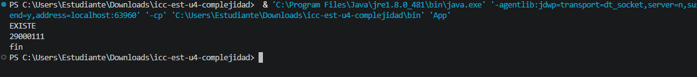

 # Práctica: 04.01 Complejidad Proyecto  JAVA 

## Datos del Estudiante
- **Nombre:** [Jordan Sagbay ]
- **Curso:** [grupo 3 ]
- **Fecha:** [14/04/2026]

---

## 1. icc-est-u4-complejidad

**Fecha:** 14/04/2026

**Descripción:** Creamos el proyecto y lo subimos 

---

## 2. icc-est-u4-complejidad

**Fecha:** 15/04/2026
**Descripción:** Creamos la clase Estudiantes y Generadores y creamos un listado de estudiantes con datos aleatorios para buscar un estudinte.

---

